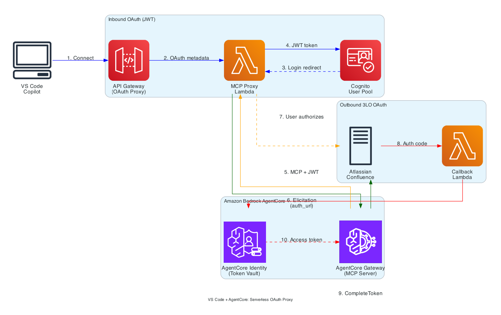

# VS Code + AgentCore Gateway: Serverless OAuth Proxy

## Overview

This document explains how to connect **Visual Studio Code with Copilot** to **Amazon Bedrock AgentCore Gateway** using a **serverless OAuth proxy** deployed on AWS, with **Atlassian Confluence** as a backend tool using **OAuth 2.0 Authorization Code Grant (3LO)** for user-delegated access.

**Key Benefit**: No local servers required. The OAuth proxy and callback handler run as Lambda functions behind API Gateway in AWS, allowing developers to connect VS Code directly to a cloud endpoint.

**Note**: This example requires `MCP-Protocol-Version: 2025-11-25` which adds URL elicitation, configured in VS Code's `mcp.json` using the `headers` field.

## Architecture



**Flow Summary:**
1. VS Code connects to Amazon API Gateway (public endpoint) via MCP/HTTP
2. MCP Proxy Lambda handles OAuth metadata discovery and callback interception
3. User authenticates with Cognito via browser
4. Proxy Lambda forwards authenticated requests to AgentCore Gateway with JWT
5. AgentCore Gateway returns 3LO elicitation when Confluence access is needed
6. User grants consent in browser via Atlassian OAuth
7. Callback Lambda receives authorization code and calls `CompleteResourceTokenAuth`
8. AgentCore Gateway can now call Confluence API on behalf of user (tokens cached by AgentCore Identity)

## Two OAuth Flows

| Flow | Purpose | Direction | When |
|------|---------|-----------|------|
| **Inbound Auth** | VS Code authenticates to AgentCore Gateway | VS Code → Cognito → AgentCore Gateway | On MCP server connection |
| **Outbound Auth (3LO)** | AgentCore Gateway accesses Confluence on behalf of user | AgentCore Gateway → Atlassian → User consent | On first Confluence tool call |

### Token Lifetime and Consent Persistence

**How often will users be prompted for Confluence consent?**

AgentCore Identity manages 3LO tokens automatically:
- When the user completes 3LO, AgentCore stores both the access token and refresh token
- On subsequent tool calls, AgentCore uses the stored token — no user interaction
- When the access token expires, AgentCore automatically refreshes it using the refresh token

**Consent lifetime is controlled by Atlassian (the OAuth provider), not AgentCore:**
- Atlassian refresh tokens are long-lived (~90 days of inactivity)
- As long as the token is used periodically, users won't be re-prompted
- Re-consent is required if: (a) user revokes access in Atlassian settings, (b) refresh token expires from inactivity, or (c) the app's requested scopes change

**The `offline_access` scope** (configured in the notebook) is what enables refresh tokens. Without it, users would need to re-authenticate every time the access token expires (typically 1 hour).

**Note**: Cognito handles only inbound auth (VS Code → AgentCore Gateway). The 3LO tokens for Confluence are managed entirely by AgentCore Identity.

## Serverless vs Local Proxy

This example could be also deployed with local callback and proxy servers. Having those in the AWS cloud offers advantages, detailed below.

| Aspect | Local Proxy (notebook 02) | Serverless Proxy (notebook 03) |
|--------|---------------------------|--------------------------------|
| **Setup** | Run 2 local Python servers | Deploy once via notebook |
| **Developer Experience** | Start servers before each session | Just configure VS Code |
| **Endpoint** | `http://127.0.0.1:8080` | `https://<api-id>.execute-api.<region>.amazonaws.com` |
| **Scalability** | Single developer | Team-wide deployment |
| **Cost** | Free (local) | Pay-per-use (Lambda + API Gateway) |

## Components

| Component | Purpose |
|-----------|---------|
| **Amazon API Gateway** | Public HTTPS endpoint for VS Code (HTTP API) |
| **MCP Proxy Lambda** | OAuth metadata, callback interception, token proxying, MCP forwarding |
| **Callback Lambda** | 3LO OAuth callbacks, `CompleteResourceTokenAuth` |
| **Cognito User Pool** | JWT tokens for inbound authentication |
| **AgentCore Gateway** | AWS-managed MCP server with Confluence target |

**Note on terminology**: This architecture uses two different "gateways":
- **Amazon API Gateway**: The HTTP API that exposes Lambda functions as a public endpoint
- **AgentCore Gateway**: The AWS-managed MCP server that routes tool calls to Confluence

## Key Technical Details

### Why the Proxy Architecture is Needed

This solution uses Amazon API Gateway + AWS Lambda functions as a proxy layer between VS Code and AgentCore Gateway. This architecture is needed for two reasons:

1. **OAuth Authorization Server Facade**: VS Code's MCP client expects to interact with OAuth endpoints (`/authorize`, `/token`) at the MCP server URL. AgentCore Gateway validates incoming JWTs but doesn't act as an OAuth Authorization Server. The MCP Proxy Lambda provides this facade, proxying OAuth requests to Cognito while handling redirect interception and state management. The proxy also serves its own RFC 9728 Protected Resource Metadata (`/.well-known/oauth-protected-resource`) because the `resource` identifier must match the URL the client connects to (the proxy URL), not the underlying Gateway URL.

2. **3LO Callback Handling with Session Binding**: When a user completes 3LO consent (e.g., granting Confluence access), the OAuth callback must be received and the `CompleteResourceTokenAuth` API must be called with the user's identity to bind the token. The Callback Lambda handles this flow. While a managed 3LO callback endpoint currently not natively supported in AgentCore Gateway, this Lambda provides the callback handling and session binding.

### MCP-Protocol-Version Header

The `MCP-Protocol-Version: 2025-11-25` header is required for 3LO elicitation. Configure in VS Code's `mcp.json`:

```json
{
  "servers": {
    "agentcore-confluence": {
      "type": "http",
      "url": "https://<api-gateway-url>",
      "headers": {
        "MCP-Protocol-Version": "2025-11-25"
      }
    }
  }
}
```

### 3LO Elicitation Response

When a tool requires user OAuth consent, the gateway returns error code `-32042`:

```json
{
  "error": {
    "code": -32042,
    "message": "This request requires more information.",
    "data": {
      "elicitations": [{
        "mode": "url",
        "elicitationId": "...",
        "url": "https://bedrock-agentcore.us-west-2.amazonaws.com/identities/oauth2/authorize?...",
        "message": "Please login to this URL for authorization."
      }]
    }
  }
}
```

## Setup

### Prerequisites
- Python 3.10+
- AWS credentials configured with permissions for Lambda, API Gateway, Cognito, IAM, and Bedrock AgentCore
- Atlassian Cloud account with Confluence
- VS Code 1.107+ with GitHub Copilot - This version adds support for the 3LO URL elicitation

### Step 1: Create Atlassian OAuth App
1. Go to https://developer.atlassian.com/console/myapps/
2. Create → OAuth 2.0 integration
3. Under **Permissions**, add these **granular scopes** for Confluence:
   - `read:space:confluence`
   - `read:page:confluence`
4. Copy Client ID and Client Secret
5. Add the AgentCore callback URL (shown after running notebook)

**Note**: The `offline_access` scope (for refresh tokens) is a standard OAuth scope — you don't configure it in the console. It's automatically requested by AgentCore when making the authorization request.

### Step 2: Run the Setup Notebook

Run `01_vscode_agentcore_confluence_serverless.ipynb` to create:
- API Gateway with Lambda integrations
- MCP Proxy Lambda function
- Callback Lambda function
- Cognito User Pool with app client
- AgentCore Gateway with Cognito JWT auth
- Atlassian credential provider
- Confluence target with 3LO OAuth

The notebook outputs the API Gateway URL and VS Code configuration.

### Step 3: Configure VS Code

Add to `.vscode/mcp.json` (values from notebook output):

```json
{
  "servers": {
    "agentcore-confluence": {
      "type": "http",
      "url": "https://<api-gateway-id>.execute-api.<region>.amazonaws.com",
      "headers": {
        "MCP-Protocol-Version": "2025-11-25"
      }
    }
  }
}
```

### Step 4: Connect and Use
1. Reload VS Code
2. Complete Cognito OAuth when prompted (user: `vscode-user`, password: `TempPassword123!`)
3. Use Confluence tools - 3LO consent will be triggered on first use
4. After granting Atlassian consent, retry the tool call

## Troubleshooting

### "Cannot initiate authorization code grant flow"
**Cause**: Gateway not receiving `MCP-Protocol-Version: 2025-11-25` header.
**Solution**: Add `"headers": {"MCP-Protocol-Version": "2025-11-25"}` to your mcp.json config.

### "Client is not enabled for OAuth2.0 flows"
**Cause**: Cognito app client missing `AllowedOAuthFlowsUserPoolClient=True`.
**Solution**: Re-run the notebook to recreate resources.

### "redirect_mismatch" from Cognito
**Cause**: Callback URL not registered in Cognito.
**Solution**: Ensure the API Gateway callback URL is registered. Re-run notebook if needed.

### Lambda timeout errors
**Cause**: Lambda function timing out during MCP forwarding.
**Solution**: Increase Lambda timeout in AWS Console or re-deploy with higher timeout.

### 3LO completed but tool still fails
**Cause**: VS Code doesn't auto-retry after 3LO completion.
**Solution**: Invoke the tool again after completing the 3LO flow in the browser.

## Files

| File | Description |
|------|-------------|
| `01_vscode_agentcore_confluence_serverless.ipynb` | Setup notebook for serverless deployment |
| `lambda/mcp_proxy_lambda.py` | MCP Proxy Lambda source code |
| `lambda/callback_lambda.py` | 3LO Callback Lambda source code |

## Cleanup

Run the cleanup cell at the end of the notebook, or run Step 1b on a fresh notebook execution to delete:
- API Gateway
- Lambda functions
- AgentCore Gateway and targets
- Credential providers
- Cognito User Pool
- IAM roles

## References

- [MCP Specification 2025-11-25](https://modelcontextprotocol.io/specification/2025-11-25)
- [VS Code MCP Documentation](https://code.visualstudio.com/docs/copilot/customization/mcp-servers)
- [AgentCore Gateway Documentation](https://docs.aws.amazon.com/bedrock-agentcore/)
- [AWS Lambda Documentation](https://docs.aws.amazon.com/lambda/)
- [Amazon API Gateway Documentation](https://docs.aws.amazon.com/apigateway/)
- [Confluence REST API v2](https://developer.atlassian.com/cloud/confluence/rest/v2/)
